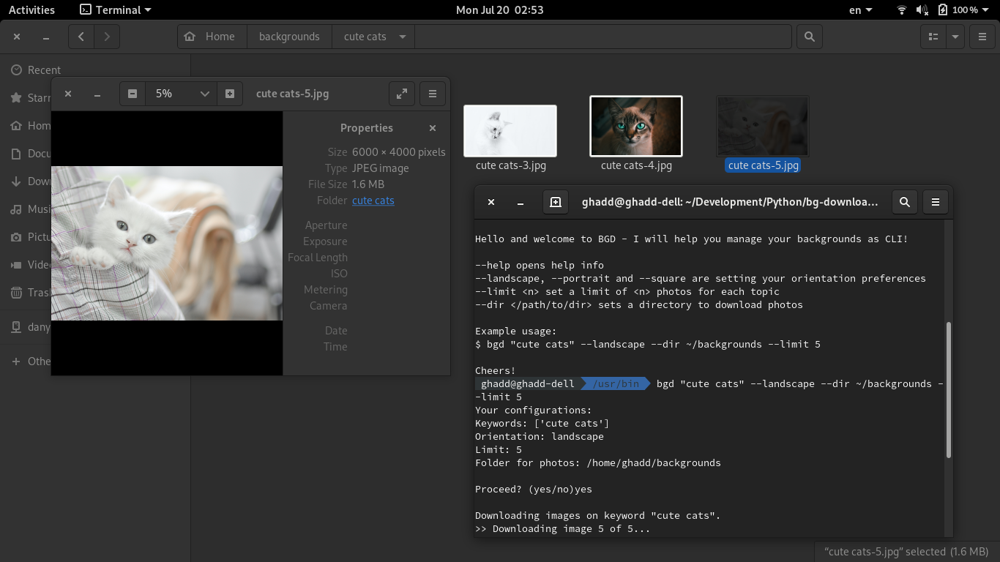

# BGD

Really mini 30min project to help you download cute backgrounds for your machine without quitting your fancy console!

## Installation 
I hope, you've already forgot what is python2, so execute this with python3-pip surely.
```
$ pip install git+https://github.com/ghadd/bg-downloader
```

## Testing out
```
$ bgd --help
```

## Try me :)
